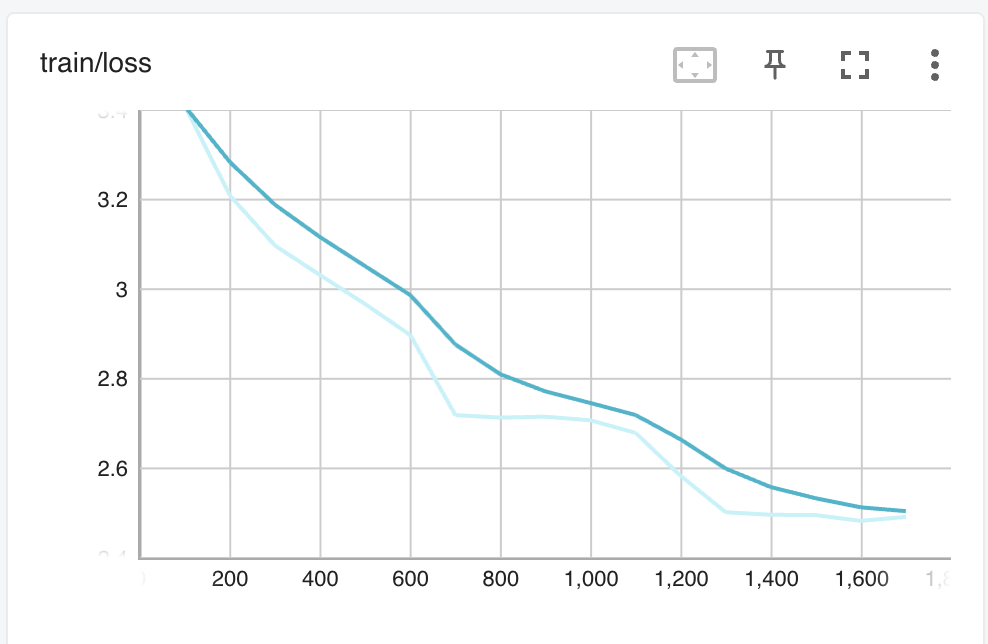
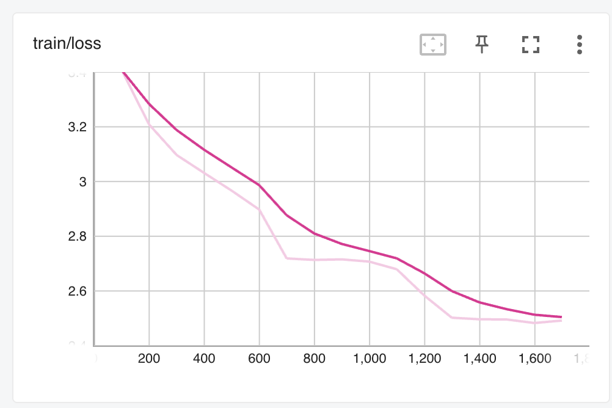

# SuperReLoRA

SuperReLoRA is an efficient fine-tuning method for large language models that combines the benefits of LoRA (Low-Rank Adaptation) with partial weight merging. This implementation provides a flexible and memory-efficient way to fine-tune transformer models.

## Features

- Partial weight merging during training
- Support for HuggingFace models and datasets
- Configurable LoRA parameters (rank, alpha, merge frequency)
- Both manual training loop and HuggingFace Trainer support
- Mixed precision training support
- Easy-to-use configuration system

## Installation

1. Clone the repository:
```bash
git clone https://github.com/deafTim/superrelora2.git
cd superrelora
```

2. Create a virtual environment and install dependencies:
```bash
python -m venv venv
source venv/bin/activate  # On Windows: venv\Scripts\activate
pip install -r requirements.txt
```

## Usage

### Training

1. Configure your training parameters in `training_configs/superrelora_160m.yaml`

2. Run training using the provided script:
```bash
# Using HuggingFace Trainer
python scripts/train_superrelora.py --config training_configs/superrelora_160m.yaml --use_trainer

# Using manual training loop
python scripts/train_superrelora.py --config training_configs/superrelora_160m.yaml
```

### Running on A100

For running on an A100 GPU, use the provided script:
```bash
bash scripts/run_on_a100.sh
```

## Configuration

The training configuration is specified in YAML format. Key parameters include:

- `model_name`: Base model to use
- `dataset_name`: Dataset for training
- `lora_r`: Rank of LoRA decomposition
- `lora_alpha`: Scaling factor
- `merge_every`: Steps between partial merges
- Training parameters (batch size, learning rate, etc.)

## Project Structure

```
superrelora/
│
├── src/                       # Core implementation
│   ├── superrelora_linear.py  # SuperReLoRALinear class
│   ├── superrelora_model.py   # Model wrapper
│   └── utils.py              # Utility functions
│
├── scripts/                   # Training scripts
│   ├── train_superrelora.py  # Training script
│   └── run_on_a100.sh        # A100 setup script
│
├── configs/                   # Model configurations
│   └── llama_160m.json       # Tiny LLaMA config
│
├── training_configs/          # Training configurations
│   └── superrelora_160m.yaml # Training parameters
│
├── notebooks/                 # Analysis notebooks
│   ├── check_ranks.ipynb
│   └── plot_loss.ipynb
│
├── results/                   # Training outputs
│   └── loss_curve.png
│
├── README.md
└── requirements.txt
```

## Contributing

Contributions are welcome! Please feel free to submit a Pull Request.

## License

This project is licensed under the MIT License - see the LICENSE file for details. 


## 🧪 Experiment Details

- **Base Model:** `nicholasKluge/TeenyTinyLlama-160M`
- **Dataset:** `wikitext-2-raw-v1` (train split only)
- **Prompts for evaluation:** 1000
- **Max token length:** 64
- **Training epochs:** 3
- **Batch size:** 64
- **LoRA rank (`r`):** 8
- **LoRA alpha:** 16
- **Merge strategy:** α-merge every 500 steps (α = 0.1)
- **Training mode:** HuggingFace `Trainer`
- **Device:** NVIDIA A100 (40 GB), single-GPU
- **Precision:** bfloat16


## 📉 Training Loss (TensorBoard)

<table>
  <tr>
    <td align="center"><b>SuperReLoRA</b></td>
    <td align="center"><b>Full Fine-Tuning</b></td>
  </tr>
  <tr>
    <td></td>
    <td></td>
  </tr>
</table>

## 📊 Evaluation Results (Wikitext-2-raw-v1, max_length=64, batch_size=16)

| Model               | Accuracy | Perplexity | Final Loss |
|--------------------|----------|------------|-------------|
| Not-trained (160M) | 0.0352   | 9.63       | 2.2649      |
| SuperReLoRA (160M) | 0.0198   | 29166.98   | 10.2808     |
| Full Fine-Tuned (160M)    | 0.0197   | 29430.45   | 10.2898     |

## ⏱️ Training Summary

| Model               | Train Loss | Runtime (s) | Steps/s | Samples/s |
|--------------------|------------|-------------|---------|------------|
| SuperReLoRA (160M) | 2.7725     | 3888.98     | 0.443   | 28.325     |
| Full Fine-Tuned    | 2.7726     | 3897.23     | 0.442   | 28.265     |