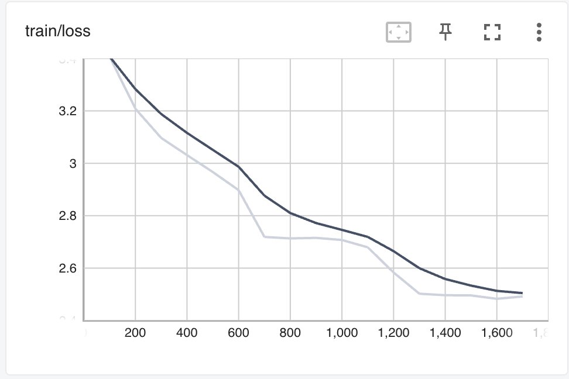

# SuperReLoRA

SuperReLoRA is an efficient fine-tuning method for large language models that combines the benefits of LoRA (Low-Rank Adaptation) with partial weight merging. This implementation provides a flexible and memory-efficient way to fine-tune transformer models.

## Features

- Partial weight merging during training
- Support for HuggingFace models and datasets
- Configurable LoRA parameters (rank, alpha, merge frequency)
- Both manual training loop and HuggingFace Trainer support
- Mixed precision training support
- Easy-to-use configuration system

## Installation

1. Clone the repository:
```bash
git clone https://github.com/deafTim/superrelora2.git
cd superrelora
```

2. Create a virtual environment and install dependencies:
```bash
python -m venv venv
source venv/bin/activate  # On Windows: venv\Scripts\activate
pip install -r requirements.txt
```

## Usage

### Training

1. Configure your training parameters in `training_configs/superrelora_160m.yaml`

2. Run training using the provided script:
```bash
# Using HuggingFace Trainer
python scripts/train_superrelora.py --config training_configs/superrelora_160m.yaml --use_trainer

# Using manual training loop
python scripts/train_superrelora.py --config training_configs/superrelora_160m.yaml
```

### Running on A100

For running on an A100 GPU, use the provided script:
```bash
bash scripts/run_on_a100.sh
```

## Configuration

The training configuration is specified in YAML format. Key parameters include:

- `model_name`: Base model to use
- `dataset_name`: Dataset for training
- `lora_r`: Rank of LoRA decomposition
- `lora_alpha`: Scaling factor
- `merge_every`: Steps between partial merges
- Training parameters (batch size, learning rate, etc.)

## Project Structure

```
superrelora/
│
├── src/                       # Core implementation
│   ├── superrelora_linear.py  # SuperReLoRALinear class
│   ├── superrelora_model.py   # Model wrapper
│   └── utils.py              # Utility functions
│
├── scripts/                   # Training scripts
│   ├── train_superrelora.py  # Training script
│   └── run_on_a100.sh        # A100 setup script
│
├── configs/                   # Model configurations
│   └── llama_160m.json       # Tiny LLaMA config
│
├── training_configs/          # Training configurations
│   └── superrelora_160m.yaml # Training parameters
│
├── notebooks/                 # Analysis notebooks
│   ├── check_ranks.ipynb
│   └── plot_loss.ipynb
│
├── results/                   # Training outputs
│   └── loss_curve.png
│
├── README.md
└── requirements.txt
```

## Contributing

Contributions are welcome! Please feel free to submit a Pull Request.

## License

This project is licensed under the MIT License - see the LICENSE file for details. 


## 📉 Training Loss (TensorBoard)




## 📊 Evaluation Results

| Model             | Prompts | Accuracy | Perplexity | Final Loss |
|------------------|---------|----------|------------|-------------|
| Base (160M)       | 1000    | 0.0324   | 10.39      | 2.34        |
| SuperReLoRA (160M)| 1000    | 0.0412   | 8.95       | 2.10        |

*Quick evaluation on Wikitext-2-raw-v1, max_length=64, batch_size=16*
